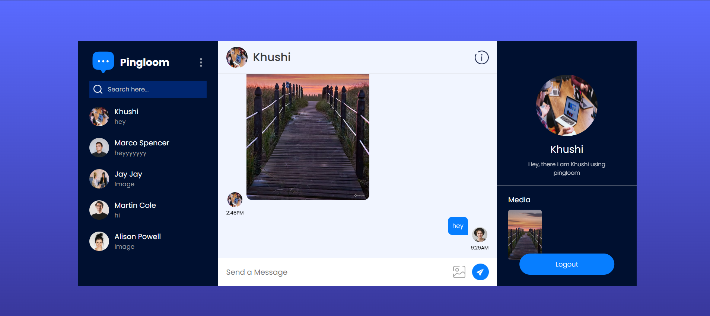

# Pingloom - Real Time Chat Application

Pingloom is a real-time chat application built using React and Firebase.  
It allows users to sign up, create profiles, search for other users, and send messages or images instantly.

The application uses Firebase Firestore for real-time updates, so messages appear instantly without refreshing the page.

---

## Features

- User Authentication (Signup / Login)
- Profile setup with avatar and bio
- Real-time messaging
- Send images in chat
- Search users and start conversations
- Online status indicator
- Media gallery for shared images
- Responsive chat interface

---

## Tech Stack

Frontend
- React (Vite)
- React Router
- Context API
- CSS

Backend / Services
- Firebase Authentication
- Firebase Firestore
- Cloudinary (Image Upload)

Libraries
- React Toastify

---

## Screenshots

### Login Page


### Chat Interface


### Profile Setup


---

## Project Structure

```
src
│
├── assets
│
├── components
│   ├── ChatBox
│   ├── LeftSidebar
│   └── RightSidebar
│
├── context
│   └── AppContext.jsx
│
├── pages
│   ├── Chat
│   ├── Login
│   └── ProfileUpdate
│
├── config
│   └── firebase.js
│
├── lib
│   └── upload.js
│
├── App.jsx
├── main.jsx
└── index.css
```

---

## Installation

Clone the repository

```
git clone https://github.com/Khushi280605/pingloom-chat-app.git
```

Go into the project folder

```
cd pingloom-chat-app
```

Install dependencies

```
npm install
```

Run the project

```
npm run dev
```

---

## Firebase Setup

1. Create a Firebase project
2. Enable Authentication (Email/Password)
3. Enable Firestore Database
4. Add your Firebase configuration inside

```
src/config/firebase.js
```

---

## Cloudinary Setup

1. Create a Cloudinary account
2. Create an unsigned upload preset
3. Add your Cloudinary cloud name and preset inside

```
src/lib/upload.js
```

---

## Future Improvements

- Typing indicator
- Group chats
- Push notifications
- Message reactions
